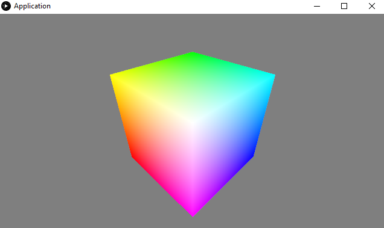

# processing-base-project

This is a basic project schema using [Processing](https://processing.org/) with [Apache Maven](https://maven.apache.org).
Based on the [RBG Cube example](https://processing.org/examples/rgbcube.html).

Execution sample:



## Howto build ##
----
Requirements:
 * Latest stable [Oracle JDK 8](https://www.oracle.com/technetwork/java/javase/downloads/index.html)
 * Latest stable [Apache Maven](https://maven.apache.org/download.cgi)

Console commands:
 ```
 cd processing_base_project
 mvn clean package assembly:single
 java -jar target/processing-base-project-1.0-SNAPSHOT-jar-with-dependencies.jar
 ```
